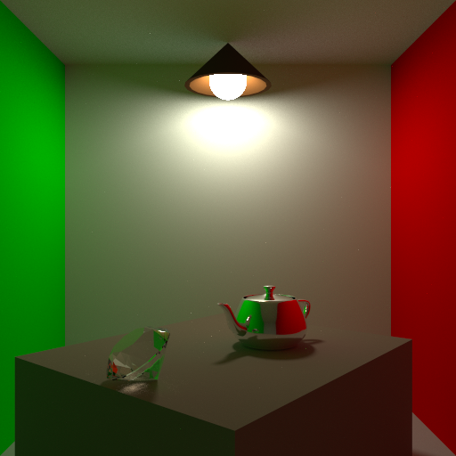
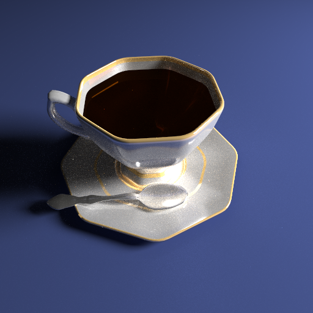
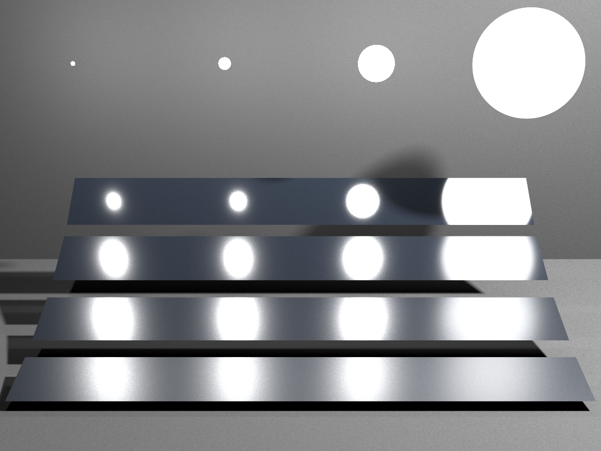
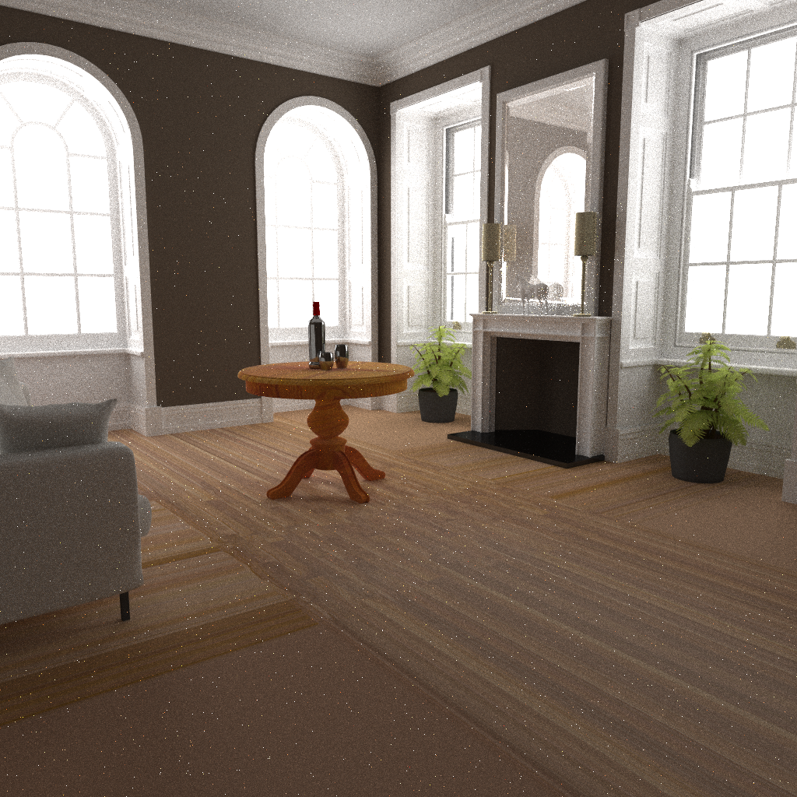
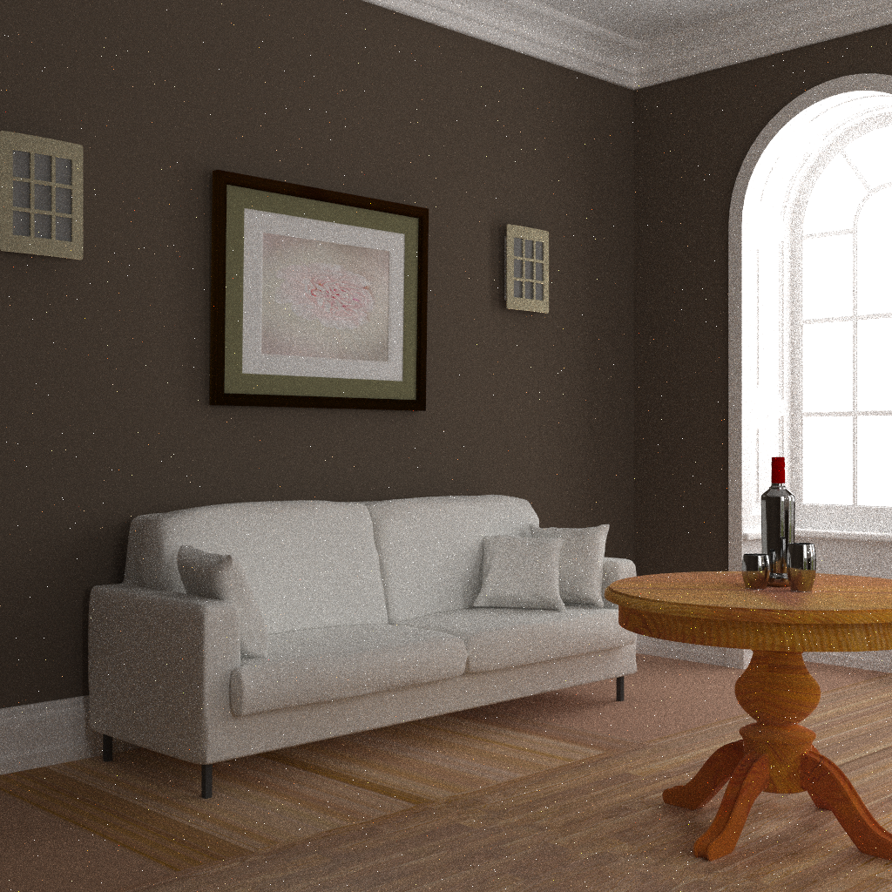

# Monte Carlo Path Tracing

2018年计算机图形学课程作业

实现了**Multi-importance sampleing**以及**多种Material**。并利用**OpenMP**进行多线程加速。

## Acknowledgements
[AGraphicsGuy](https://agraphicsguy.wordpress.com)
[Peter Shirley and his book](https://github.com/petershirley)
[PRBT's writers](https://www.pbrt.org/)

## 编程环境

在**Ubuntu 16.04LTS**上进行了测试，能够成功编译运行测试场景放在`assets`文件夹内，运行前请将model.zip解压，运行时请注意路径是否正确。

主要依赖：

- [CMake](http://www.cmake.org/)
- [GLM](https://glm.g-truc.net/)
- [json](https://github.com/nlohmann/json)
- [tinyobjloader](https://github.com/syoyo/tinyobjloader)
- [stb](https://github.com/nothings/stb)

利用`GLM`进行矩阵运算；利用`json`读取Camera等参数设置；利用`tinyobjloader`读取模型；利用`stb`读取图片。

### 编译方法

首先需要安装`GLM`：
```bash
sudo apt-get install libglm-dev
```

然后进入根目录：
```bash
mkdir build && cd build
cmake ..
make -j
```

### 运行方法

利用写好的几个`.pt`文件（用于记录Camera等参数）可以执行测试用的几个场景：
```bash
# 场景1:room
time ./Path-Tracing ../assets/models/Scene01/room.pt
```


```bash
# 场景2:cup
time ./Path-Tracing ../assets/models/Scene02/cup.pt
```


```bash
# 场景3:veach mis
time ./Path-Tracing ../assets/models/Scene03/veach.pt
```


```bash
# 场景4:fireplace room
time ./Path-Tracing ../assets/models/fireplace_room/fireplace_1.pt
```




